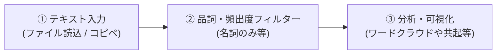

# テキスト分析ツール (Text Analytics App) 利用者マニュアル＆チュートリアル

本ツールは、日本語テキストの形態素解析から、ワードクラウド・共起ネットワーク・主成分分析 (PCA)・トピックモデル (LDA) などの高度な可視化・分析までを、ブラウザ上で直感的に実行できるWebアプリケーションです。

データを外部サーバーへ送信せず、すべてお使いのWebブラウザ内（ローカル環境）で安全に高速処理します。

---

## 📌 目次
1. [本ツールの特長](#1-本ツールの特長)
2. [動作環境・使い方](#2-動作環境使い方)
3. [クイックスタート（3ステップの流れ）](#3-クイックスタート3ステップの流れ)
4. [画面構成・データ入力](#4-画面構成データ入力)
   - [データ取り込み（2通りの方法）](#4-1-データ取り込み2通りの方法)
   - [解析フィルター設定](#4-2-解析フィルター設定)
5. [多彩な分析・可視化機能](#5-多彩な分析可視化機能)
   - [ワードクラウド](#5-1-ワードクラウド)
   - [共起ネットワーク](#5-2-共起ネットワーク)
   - [棒グラフ（出現頻度）](#5-3-棒グラフ出現頻度)
   - [KWIC検索（文脈確認）](#5-4-kwic検索文脈確認)
   - [PCA散布図（主成分分析）](#5-5-pca散布図主成分分析)
   - [トピック分析（LDAモデル）](#5-6-トピック分析ldaモデル)
6. [応用設定（カスタム辞書機能）](#6-応用設定カスタム辞書機能)
7. [結果のエクスポート（画像出力）](#7-結果のエクスポート画像出力)
8. [よくある質問（FAQ）](#8-よくある質問faq)
9. [ディレクトリ構成と使用ライブラリ](#9-ディレクトリ構成と使用ライブラリ)

---

## 1. 本ツールの特長

* 🔒 **安心の完全オフライン動作**: クライアントサイドのみで完結。社外秘データや個人情報を含むテキストも安心して分析できます。
* 🧠 **kuromoji.js による本格的な形態素解析**: ブラウザ上で動作する辞書を内蔵し、高精度な単語分割を行います。
* 🕸️ **独自の物理演算エンジン**: 共起ネットワーク等においてノードが重ならない見やすい独自のフォースディレクテッドアルゴリズムを採用。
* 📊 **PCAやLDAなど高度なテキストマイニング手法**: 頻度だけでなく、文脈の類似度や潜在トピックを自動で抽出し可視化します。
* 📝 **ユーザー辞書機能**: 不要な語を省くストップワード、表記揺れをまとめる同義語、新しい複合名詞などを自由に定義し、ローカルに保存可能。

---

## 2. 動作環境・使い方

本ツールはサーバーや特別なインストール作業を必要としません。

1. **動作環境**: Google Chrome, Microsoft Edge, Safari などのモダンブラウザ
   - *（注：Kuromoji.jsは辞書ファイルをAjaxで読み込むため、ローカルの `file://` スキームではブラウザのセキュリティ設定により動作しない場合があります。その場合は同梱の `kidou.bat` または簡易ローカルサーバーをご利用ください）*
2. **使い方**: Windowsの場合は `kidou.bat` をダブルクリックして起動します。または、任意のローカルサーバーでフォルダをルートにして `index.html` にアクセスしてください。

---

## 3. クイックスタート（3ステップの流れ）



---

## 4. 画面構成・データ入力

### 4-1. データ取り込み（2通りの方法）

画面左側のサイドバーからデータソースを指定します。

1. **ファイル選択 (ドラッグ＆ドロップ)**: テキストファイル (`.txt`), CSV (`.csv`), TSV (`.tsv`) などをドロップするか、「ファイルを選択」から読み込ませます。
2. **直接貼り付け (コピペ)**: Web記事や資料のテキストをコピーして、テキストエリアに直接貼り付けます。
※ 「デモデータを読み込む」ボタンで、テスト用のサンプルテキストをすぐに試すことも可能です。

---

### 4-2. 解析フィルター設定

どのような単語を抽出するかを細かく制御できます。

* **対象品詞**: 名詞、動詞、形容詞、副詞 から分析対象とする品詞を絞り込みます。
* **複合名詞の抽出**: 「連続する名詞を結合する」をONにすると、「人工」＋「知能」を「人工知能」のように1つの単語として認識します。
* **重要度判定の基準**: 
  - **頻出度**: 単純な出現回数でランキングします。
  - **特徴度 (TF-IDF順)**: 頻出するが一般的すぎる単語のスコアを下げ、そのテキスト特有の特徴的な単語を浮き彫りにします。
* **スライダー調整**: 最小出現回数（ノイズ除去）と最大表示単語数を直感的に調整できます。

---

## 5. 多彩な分析・可視化機能

プルダウンから分析手法を選び、「再描画・解析」を押すことで様々な角度からテキストを俯瞰できます。

### 5-1. ワードクラウド
* 出現頻度（またはTF-IDFスコア）が高い単語ほど大きく表示されます。
* テキストの「全体像」や「主役となるキーワード」を直感的に把握するのに最適です。

### 5-2. 共起ネットワーク
* 一緒に使われやすい（共起関係にある）単語同士を線で結び、ネットワーク構造として表示します。
* 内蔵の物理演算エンジン（Force-Directed）により、自動的に見やすい配置へと解きほぐされます。単語同士の文脈的なつながり（どの単語がハブになっているかなど）が分かります。

### 5-3. 棒グラフ（出現頻度）
* 単語の出現数を定量的なランキング形式で確認できます。

### 5-4. KWIC検索（文脈確認）
* 指定した単語が「具体的にどのような文脈（前後の文章）で使われているか」を一覧表示します。
* また、検索した単語を中心とした「ミニ共起ネットワーク」も同時生成され、関連する言葉を深掘りできます。

### 5-5. PCA散布図（主成分分析）
* 単語間の共起行列を主成分分析 (PCA) により2次元に圧縮・投影し、散布図として描画します。
* 近くに配置された単語は「似た文脈で使われやすい」ことを示しており、テキスト内の「テーマのまとまり」を空間的に把握できます。

### 5-6. トピック分析（LDAモデル）
* 機械学習の手法（潜在ディリクレ配分法）を用いて、テキストの文面から背後にある「複数のトピック（潜在話題）」を自動で推測・分類します。
* トピック数は自動設定のほか、手動で指定することも可能です。

---

## 6. 応用設定（カスタム辞書機能）

自然言語処理にありがちな「表記揺れ」や「ノイズ単語」を解消するための強力な辞書機能です。右下の「辞書/設定」ボタンから開けます。

1. **除外語 (ストップワード)**: 「する」「ある」など、分析結果から非表示にしたい不要な単語を登録します。
2. **同義語・表記揺れ統合**: 「PC=パソコン」「スマホ=スマートフォン」のように、複数の表現を代表的な1つの単語にまとめます。
3. **強制抽出ワード**: 形態素解析器が誤って分割してしまう固有固有名詞や新語などを、強制的に1つの単語として抽出させます。

これらの設定は**ブラウザのローカルストレージに自動保存**されるため、次回アクセス時にもそのまま利用できます。

---

## 7. 結果のエクスポート（画像出力）

* 右上の **「画像を保存」** アイコン（カメラマーク）をクリックすると、現在表示されているワードクラウドやネットワーク図、グラフを高品質な PNG 画像ファイルとしてダウンロードできます。
* プレゼン資料やレポートへの貼り付けに活用してください。

---

## 8. よくある質問（FAQ）

### Q1. ローカルファイルをブラウザにドラッグしても反応しません/エラーが出ます。
**A.** Kuromojiの辞書ファイルを読み込む際、ブラウザのセキュリティ制限 (CORS) によりエラーになる場合があります。Windowsの場合は同梱の `kidou.bat` を使用するか、VS Codeの「Live Server」やPythonの簡易サーバー (`python -m http.server`) などを経由して開いてください。

### Q2. 英語のテキスト分析も可能ですか？
**A.** 本ツールは日本語の形態素解析（kuromoji.js）に特化しているため、英文を流し込むと正しい単語分割が行われません。基本的には日本語テキスト専用としてご利用ください。

### Q3. 分析に時間がかかります。
**A.** 非常に長大なテキストや、最大表示単語数を極端に大きく設定した場合、ブラウザ側での計算・描画処理（特にネットワーク描画やLDA分析）に数秒〜十数秒かかる場合があります。「最小出現回数」を上げたり「最大表示単語数」を下げることで高速になります。

---

## 9. ディレクトリ構成と使用ライブラリ

### ディレクトリ構成
```text
wordcloud-app/
├── index.html        # メインのアプリケーション画面
├── kidou.bat         # ローカルサーバー起動用バッチ (Windows向け)
├── css/              # スタイルシート
├── js/               # メインロジック (app.js)
├── lib/              # 外部ライブラリ群 (kuromoji, wordcloud2, html2canvas)
├── data/             # デモデータなど
├── server/           # 拡張用バックエンドサーバーコード
├── scripts/          # 開発用スクリプト群
└── README.md         # 本ドキュメント
```

### 使用ライブラリ（フロントエンド）
本ツールは以下のオープンソースライブラリを利用しています。
* **[Kuromoji.js](https://github.com/takuyaa/kuromoji.js/)**: ブラウザ上で動作する日本語形態素解析器
* **[wordcloud2.js](https://github.com/timdream/wordcloud2.js/)**: HTML5 Canvasを利用したワードクラウド描画
* **[html2canvas](https://html2canvas.hertzen.com/)**: グラフのPNG画像出力

※ 物理演算エンジン、PCA、LDAのアルゴリズムは外部ライブラリに依存せず、内蔵の専用JavaScriptロジックとして実装されています。

---

*【テキスト分析ツール】*
*テキストデータを直感的に可視化し、潜在的なインサイトの抽出を強力に支援します。*
