# 日本語テキスト多角分析・可視化ツール 詳細チュートリアル＆アルゴリズム解説

本ツールは、専門的な環境構築を必要とせず、ブラウザ上で高度なテキストマイニング（自然言語処理と多変量解析）を可能にするツールです。
本ドキュメントでは、各機能の詳しい操作手順と、その裏側で動いている統計手法のロジックについて解説します。

---

## 1. データの読み込みと初期化

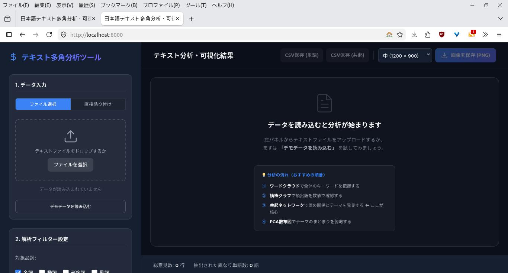

### 操作手順

1. 画面左側の「1. データ入力」パネルを使用します。
2. **ファイルから読み込む場合**：TXTファイル、またはCSVファイルを画面上の「**テキストファイルをドロップする**」エリアにドラッグ＆ドロップします。CSVの場合は、列を選択する画面が出るので、分析対象のテキストが含まれる列を指定してください。「ファイルを選択」を選ぶとPCのフォルダが表示されますので、対象ファイルを選んでください。

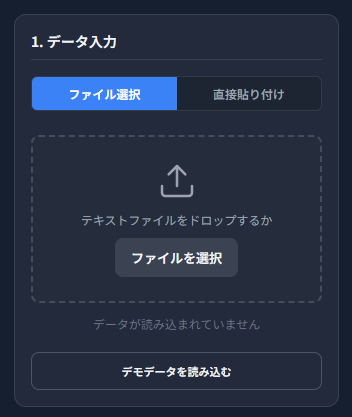

3. **直接入力する場合**：「**テキスト直接入力**」タブをクリックし、入力窓にコピー＆ペーストし、「分析を実行」ボタンを押します。

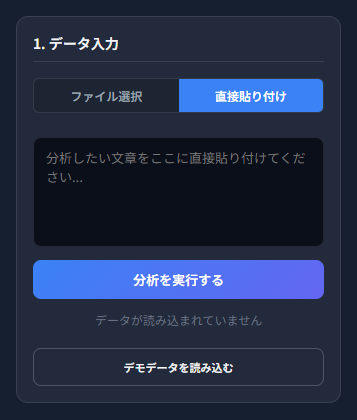

### 内部処理のロジック

読み込まれたテキストは、ツールに搭載された形態素解析器（Kuromoji）によって単語（トークン）に分割されます。この際、改行区切りの「1行（1レコード）」を「1つの文書（Document）」として扱うため、アンケートの自由記述やSNSの投稿などでは、**一つの意見を1行**でファイルを作成してください。

なお、KuromojiはMeCabと同等の分類を行いますが、このツールでは利用する辞書が異なるため、分類の結果は両者で一致しません。

---

## 2. 頻度と特徴の抽出（ワードクラウド / 棒グラフ）

テキスト内で「何が重要なキーワードか」を把握するための基本的な機能です。

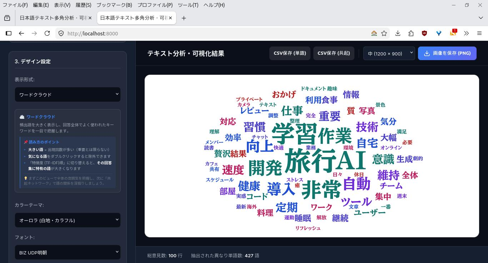

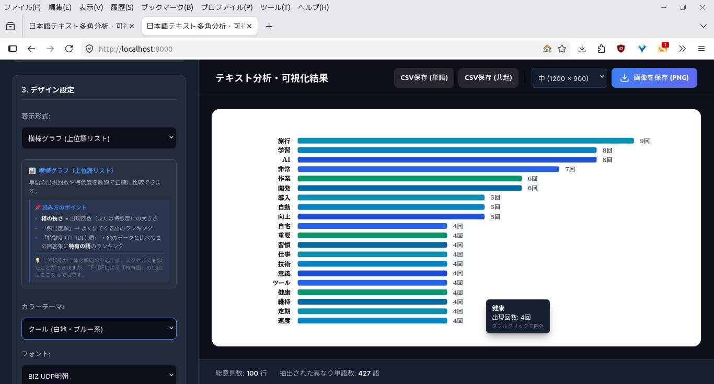

### 操作手順

1. 画面右上のタブから「**ワードクラウド**」または「**横棒グラフ（上位語リスト）**」を選択します。

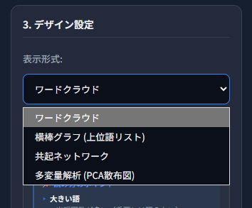

2. 左サイドバーの「解析フィルター設定」にある「重要度判定の基準」で、「**頻出度（出現回数順）**」か「**特徴度（TF-IDF順）**」を選択します。

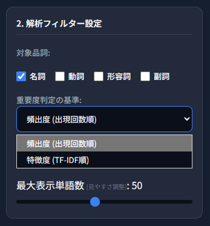

3. グラフ上の単語にマウスカーソルを合わせる（ホバーする）と、正確な数値が表示されます。（すべてのグラフで有効です）

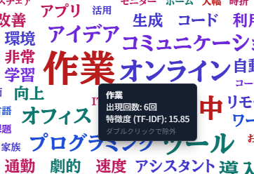

### 統計手法：TF-IDF（Term Frequency - Inverse Document Frequency）

「頻出度（出現回数順）」では、「する」「ある」「こと」などの意味の薄い単語が上位を占めてしまい、本当に意味のあるキーワードが埋もれてしまうことがあります。これを解決するのがTF-IDFです。（一般的にノイズとなる単語はあらかじめ分析の対象外にしていますが、「多い」「少ない」などの単語は現れます）

* **TF（単語の出現頻度）**: その単語がテキスト全体で何回出現したか。
* **IDF（逆文書頻度）**: 全体の行数（文書数）を、その単語が出現した行数で割った値の対数（Log）。いろいろな行に広く出現する一般的な単語ほど、この値が小さくなります。

本ツールでは `TF × IDF` をスコアとして採用しており、これによって**「出現回数は多いが、特定の文脈（行）に集中的に登場する、そのテキスト特有の特徴的な単語」**が大きく表示されるようになります。

---

## 3. 文脈の構造化（共起ネットワーク）

単語単体の頻度ではなく、「どの単語とどの単語が一緒に使われているか（共起）」をネットワーク状に可視化します。

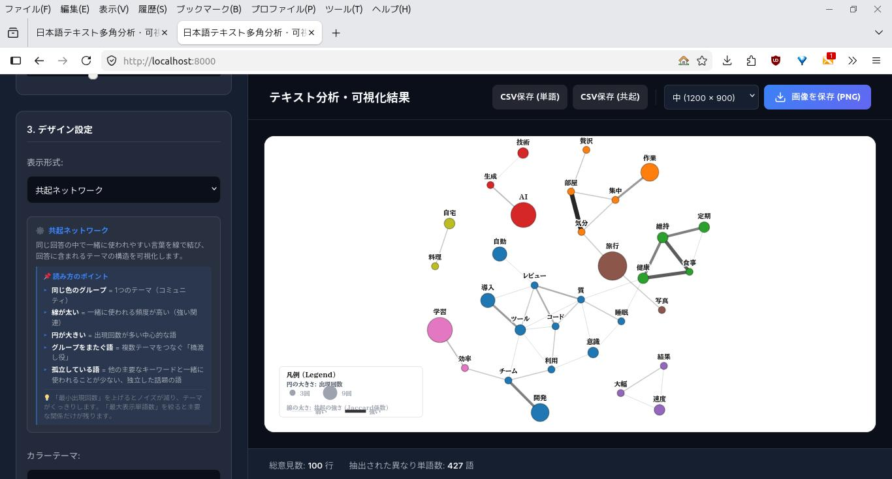

### 操作手順

1. 右上のタブから「**共起ネットワーク**」を選択します。

2. 各ノード（単語）は色分けされており、この色は後述する「**コミュニティ（話題のグループ）**」を表しています。（**自動的にグループ分けされます**）
3. **グラフの形は毎回異なります**。作図が安定しない時は、対象単語数などを変更して、再描画してください。（※ノード数を30～40位にすると安定するようです）

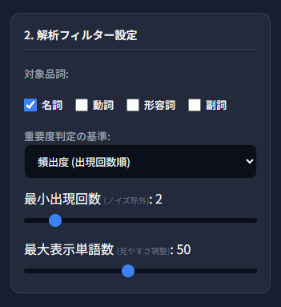

### 統計手法①：Jaccard（ジャカード）係数

単語同士を線（エッジ）で結ぶ基準として、単純な「一緒に登場した回数」を使うと、TF-IDFの時と同じように「超高頻度の単語」がすべての単語と結びついてしまいます。本ツールでは、集合の類似度を測る**「Jaccard係数」**を用いてエッジの重みを計算しています。

* **計算式**: `(単語AとBが両方存在する行数) ÷ (単語AまたはBが存在する行数)`

これにより、「単語Aが出たときは、かなりの確率で単語Bも出る」という真の相関関係だけを抽出し、係数が閾値（0.05）以上のものだけを線で結んでいます。

### 統計手法②：Louvain（ルーバン）法によるコミュニティ抽出

ネットワーク図の色分けはランダムではありません。ネットワーク分析において標準的な**Louvain法**を用いて自動計算されています。

このアルゴリズムは、ネットワーク内の「モジュラリティ（コミュニティ内部の線の密度と、外部への線の密度の差）」を最大化するようにノードをグループ分けします。結果として、色が同じ単語群は**「1つの具体的なトピック（話題の塊）」**を形成していると解釈できます。

---

## 4. 出現パターンの探索（主成分分析 - PCA）

単語の出現パターンの類似性を、2次元の散布図として空間的にマッピングします。

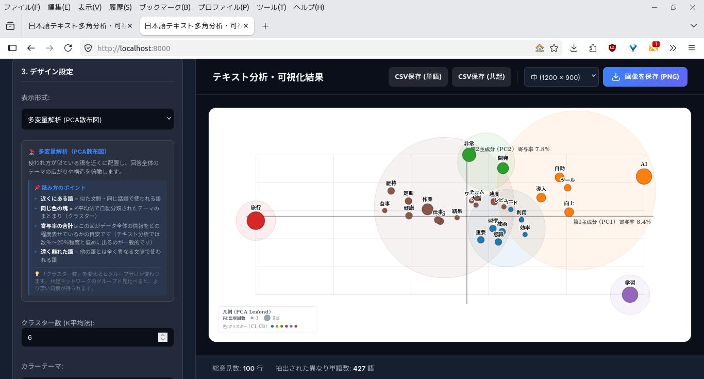

### 操作手順

1. 右上のタブから「**多変量解析（PCA散布図）**」を選択します。

2. 画面の縦軸（PC2）と横軸（PC1）には、それぞれ「寄与率（元のデータの分散をどれくらい説明できているか）」が表示されます。なおテキスト分析は、変数が多い割に数値は小さいので、各軸は高い寄与率にならないことが多いので注意してください。
3. 左サイドバーに「**クラスター数（K平均法）**」が現れるので、分割したいグループ数（3〜8程度）を指定すると、自動的に色分け表示されます。なお、**クラスター数は自動的に判定されません**ので、図や他の分析結果を参考に判断してください。

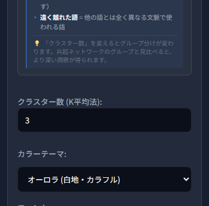

### 統計手法①：主成分分析（PCA - Principal Component Analysis）

各単語について、「どの行に出現したか」を0と1で表した巨大なベクトル（Document-Term行列）を作成します。本ツールでは、この行列の共分散行列を計算し、**べき乗法（Power Iteration）** というアルゴリズムを用いて固有値と固有ベクトル（第1・第2主成分）を高速に求めています。

これにより、何千次元もある単語の出現パターンを2次元に圧縮し、**「似たような文脈で使われる単語」が画面上で近くに配置されます**。

### 統計手法②：K平均法（K-Means++） クラスタリング

PCAで得られた2次元座標に対し、指定されたクラスター数（K）で**K-Means法(K平均法）** により自動的にグループ分けを行います。初期値の依存問題を解消するため、より安定した結果が得られる**K-Means++法**を採用し、散布図上の点（単語）を直感的なトピックごとに色分けします。

---

## 5. 潜在話題の自動抽出（トピック分析 - LDAモデル）

テキスト全体にどのようなテーマ（話題）が潜在的に含まれているかを、統計学的な確率モデル（LDA）を用いて自動分類します。

### 操作手順

1. 表示形式セレクトボックスから「**トピック分析 (LDAモデル・潜在話題)**」を選択します。
2. データセットの文書構造から、統計的モデル適合度（Perplexity/困惑度）に基づき**最適トピック数が全自動で決定**され、トピック別の「代表キーワード Top10」カードが一覧表示されます。
3. カード内の単語をクリックすると、その単語が「他のどのトピックに何％貢献しているか」という**ソフトクラスタリング割合（トピック混合分布）**と、実際の出現文章（KWIC）を同時に確認できます。

### 統計手法：LDA（Latent Dirichlet Allocation - 潜在ディリクレ配分法）

LDAは、各文書が「複数のトピックの確率的混合」であり、各トピックが「特定単語の確率的分布」であると仮定する確率モデリング手法です。

* **ソフトクラスタリング**: 単語を単一のグループに決め打ちせず、「トピックAに60%、トピックBに30%」といった確率的な重み付けで表現します。
* **トピック数の自動決定**: 最短イテレーションによるPerplexity（モデルの予測難易度）評価を実施し、データの規模や複雑さに最も見合った話題数を全自動で選出します。

---

## 5. インタラクティブな検証とデータクレンジング

統計的に導き出された結果が「実際のテキストの文脈と合っているか」を検証するための操作です。

### KWIC（Key Word In Context - クイック）表示

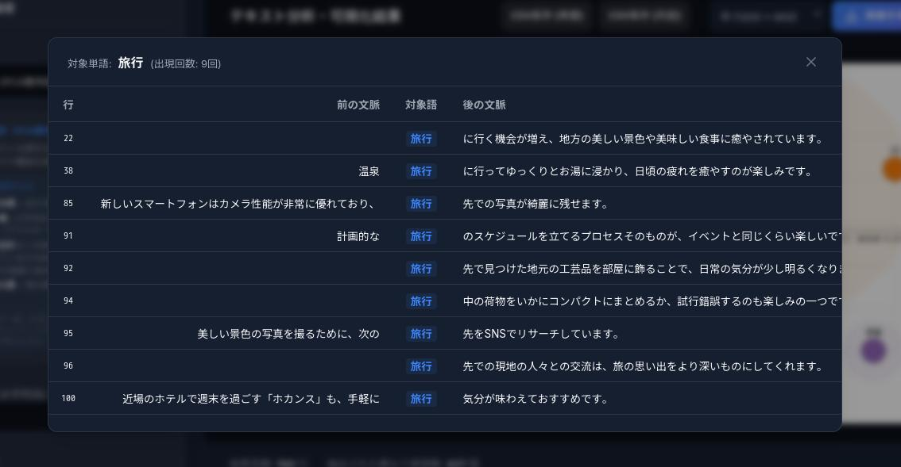

グラフ上の任意の単語（ノードや点）を**シングルクリック**すると、画面上にKWICモーダルが立ち上がります。これは、元テキストを検索し、その単語が出現する「前後の文脈（最大40文字ずつ）」を表形式で一覧表示する機能です。

* **例**: ネットワーク図で意外な単語同士が結びついていた場合、クリックしてKWICを見ることで「なるほど、こういう言い回しで使われていたのか」と裏付けを取ることができます。

### ストップワード（除外ワード）の指定

分析を進めると、「この単語は分析上のノイズになる」という単語（例：「こと」「ため」「それ」など）が見つかることがあります。
グラフ上の不要な単語を**ダブルクリック**すると、即座に除外リストに追加され、PCAやネットワーク図が自動更新されます。

このツールでは、一般的にノイズとなりやすい単語にあらかじめ除外設定をしています。作成された図を見て、さらに除外したい単語があれば手動で追加してください。指定した単語は画面に表示され、いつでも元に戻すことができます。

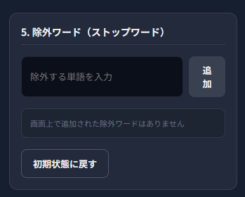

### 複合語の結合

形態素解析時に「人口」と「知能」のように分割されてしまったワードは、「3. 複合語（一つにまとめる単語）」に「人工知能」と入力し、追加することで、1つのトークンに再結合されます。

なお、この形態素解析器（Kuromoji）は、「ほたて」を「ほた」「て」と分割することがあります。こうした誤って分割された場合も「ほたて」と登録して対応してください。

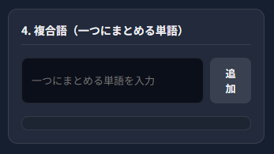

---

## 6. 分析結果のエクスポート

* **グラフ画像の保存**: 画面右下の「画像として保存 (PNG)」ボタンから、グラフをダウンロードできます。画像のサイズを大中小の3種類から選ぶことができます。
* **統計データの書き出し（CSV）**: 左サイドバーの最下部にあるボタンから、計算された生の統計指標をダウンロードできます。
  * `単語リスト (CSV)`: TF-IDFスコアなどの定量データをExcelでレポート化する際に使用します。
  * `共起ペア (CSV)`: RやPython等の専門的なネットワーク分析ソフト（Gephiなど）にデータをインポートして、さらに高度な解析を行いたい場合に使用します。
